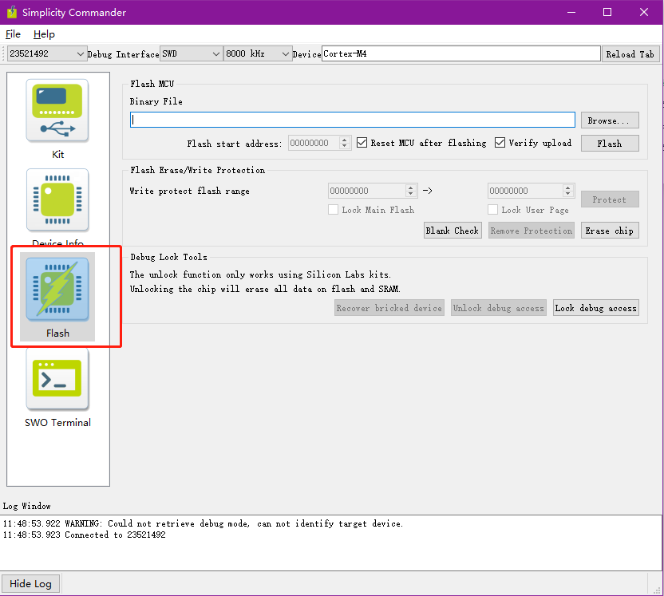

# 一、硬件准备

- **开发板**：首先需要准备好需要烧录固件的开发板，确定好下载口的位置，一般需要找到并确认 3V3（VCC）、DIO、CLK、GND 这4个引脚。
- **下载器（J-Link）**：其次准备好用来烧录固件的下载工具，这里以 J-Link V9 为例来说明。也是需要在J-Link的接口上找到并确认 3V3（VCC）、DIO、CLK、GND 这4个引脚。

然后将AT模组与下载器之间的这4个引脚同名相连，硬件连接就算是完成了。

# 二、软件准备（Simplicity Commander）

到当前仓库的`/download-tool/commander/`目录下，打开`commander.exe`。如下图所示。

这样，软件准备就算是完成了。

# 三、确认连接

双击打开`commander.exe`，运行该软件。如下图所示。

点击软件界面右上角的 **Select Kit…**，在弹出的下拉选项中单击选中下载器的序列号，即可选中相应的下载器。如下图所示：

选中之后的软件界面变为如下图所示：

此时单击软件界面左侧的 **Device Info**，可以看到软件界面会变化成如下图所示：

从上图中我们可以清晰地看出所连开发板上的芯片的详细信息，包括芯片的IEEE地址、Flash大小、RAM大小等等。

如果能够顺利地进行到这一步，那说明所有的硬件设备都是没问题的，并且每一个环节的连接也都是正常的。

# 四、烧录固件

该仓库下提供两种固件，分别在`firmware-authorized`和`firmware-open`目录下，每个目录下都有ZigBee协调器和ZigBee路由器的固件，可以根据需要自行选择烧录对应固件。如下图所示。

点击软件界面左侧 **Flash**，进入新的界面，如下图所示：

通过点击界面中的 **Browse** 进去选中需要烧录的固件之后，这边以烧录`authorized`版本固件为例，软件界面如下图所示：

点击上图中的 **Erase chip**，完成芯片擦除。进入下一步：

最后点击上图中的 **Flash**，即可完成固件的烧录。

# 五、联系作者

任何相关问题，欢迎联系作者，微信/QQ/手机同号：17780724435。
